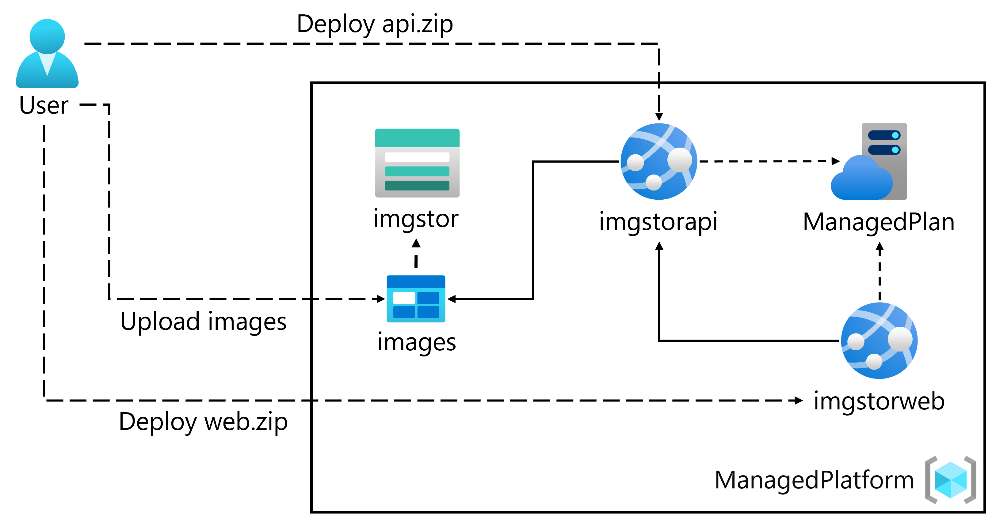

# Create Azure App Service Web Apps

## About the module

Learn how Azure App Service functions and how to create and update an app. Explore App Service authentication and authorization, configuring app settings, scale apps, and how to use deployment slots.

## Modules in this learning path:

* [Explore Azure App Service](/M1/02/Azure_app_service.md)
* [Configure web app settings](/M1/02/Config_app_service.md)
* [Scale apps in Azure App Service](/M1/02/Scaling_app_service.md)
* [Explore Azure App Service deployment slots](/M1/02/Azure_app_service_deploy.md)

 

## Hands-on Labs 

### Labs Diagram

 

* [Lab 01: Build a backend API by using Azure Storage and the Web Apps feature of Azure App Service](/M1/02/lab01.md)
* [Lab 02: Build a front-end web application by using Azure Web Apps](/M1/02/lab02.md)
* [Lab 03: Clean up your subscription](/M1/02/lab03.md)
