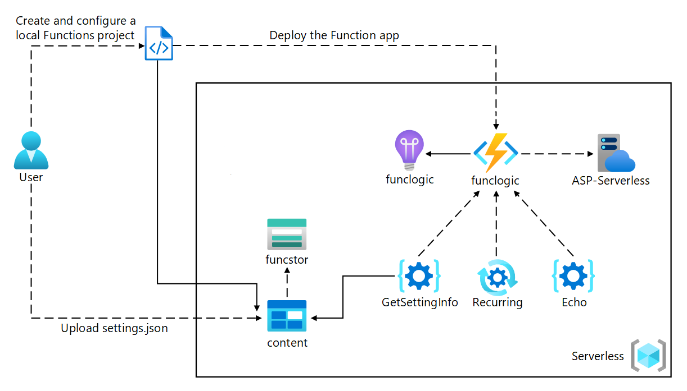

# Implement Azure functions

## About the module

Learn how to create and deploy Azure Functions. Explore hosting options, bindings, triggers, and how to use Durable Functions to define stateful workflows.

## Modules in this learning path:

* [Explore Azure Functions](/M1/03/Azure_functions.md)
* [Develop Azure Functions](/M1/03/Develop_azure_functions.md)
* [Implement Durable Functions](/M1/03/Implement_functions.md)

 

## Hands-on Labs 

### Labs Diagram

 

* [Lab 01: Create Azure resources](/M1/03/lab01.md)
* [Lab 02: Configure a local Azure Functions project](/M1/03/lab02.md)
* [Lab 03: Create a function that’s triggered by an HTTP request](/M1/03/lab03.md)
* [Lab 04: Create a function that triggers on a schedule](/M1/03/lab04.md)
* [Lab 05: Create a function that integrates with other services](/M1/03/lab05.md)
* [Lab 06: Deploy a local function project to an Azure Functions app](/M1/03/lab06.md)
* [Lab 07: Clean up your subscription](/M1/03/lab07.md)
