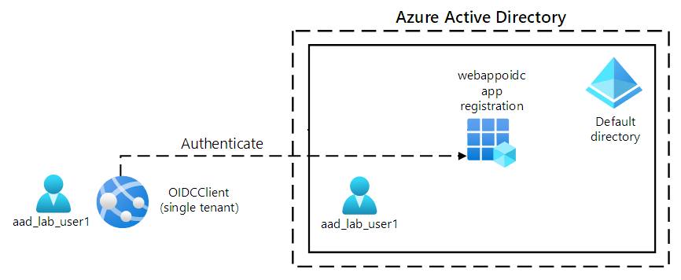

# Implement use authentication and authorization

## About the module

Learn how to implement authentication and authorization to resources by using the Microsoft identity platform, Microsoft Authentication Library, shared access signatures, and use Microsoft Graph.

## Modules in this learning path:

* [Explore the Microsoft identity platform](/M3/01/Implement_auth.md)
* [Implement authentication by using the Microsoft Authentication Library](/M3/01/Microsoft_id_platform.md)
* [Implement shared access signatures](/M3/01/Implement_shared_access.md)
* [Explore Microsoft Graph](/M3/01/Microsoft_graph.md)

## Hands-on Labs 

### Labs Diagram

* [Lab 01: Configure a single-tenant Azure AD environment](/M3/01/lab01.md)
* [Lab 02: Create a single-tenant ASP.NET web app](/M3/01/lab02.md)
* [Lab 03: Clean up your lab environment](/M3/01/lab03.md)
